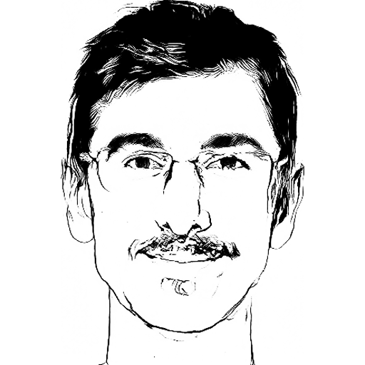

---
nocite: '@*'
---

::: {.hero}

:::: {.intro}

Hi, my name is Dimitrije[^1], and I'm a backend engineer.

I have 8 years of professional experience of designing, developing, deploying
and maintaining backend services. I'm currently working at [Nordeus](https://nordeus.com).

I write code in Java and Python, and in my own time I use Clojure and learn
Haskell. I like video and board games, science fiction and my beloved Shih Tzu
Mochiko.

::::

<figure></figure>

:::

# Posts

I write a bit, very rarely though.

You can find all posts at the [archive](./archive.html).

# Profiles

I hang out at various places online.

- [Github](https://github.com/dimitrijer)
- [Twitter](https://twitter.com/dradojevic)
- [LinkedIn](https://www.linkedin.com/in/dimitrijer/)
- [Reddit](https://www.reddit.com/user/dimitrijer89)

# Publications

::: {.refs}
:::

[^1]: as in _dim-it-rhee-ye_
